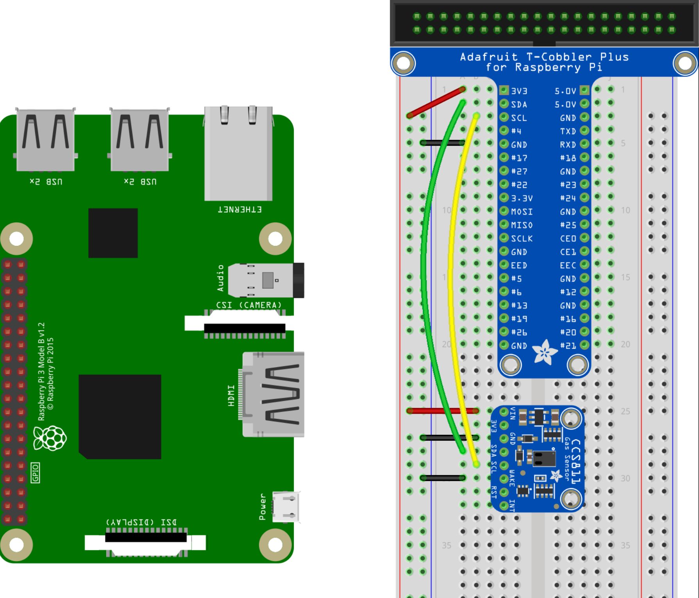

# P02: Danforth air quality

**Author(s)**: __*Robert Hogsed, Nick Straub-Deck*__

**Google Document**: __*https://docs.google.com/document/d/15SoRTspShr7JouqSE6grR3z_GPNAfuNwDM_seT34KU8/edit?usp=sharing*__

---
## Purpose
The purpose of this project is to measure the quality of air throughout the building. We are checking for both carbon monoxide and carbon dioxoide. Carbon monoxide can be deadly in relatively low amounts, it is colorless and odorless so being able to detect it is very important. Carbon dioxide is much less harmful but still can be harmful to our health and we output it naturally when we breathe. In a high enough concentration carbon dioxide can reduce our brain function so it is important that the building has good ventilation to keep carbon dioxide levels at a minimum.

## Initial Design Plan

Start
- Declare global variables for the CO and CO2 levels that will be changable through the  entire project. Will also need to delcare any
variables that need to be included if a new library is needed for this equipmen if they need to be included. Create a file for the data 
retention regarding the information gathered during the testing so it can be stored and displayed at some point in the future. 

Start of Info Gathering
- After connecting the parts together, set up the info gathering functions via the way the sensors require. If they need any special 
variables/libraries/inputs, set them up here. Using this functions set the limit for how much air we are measuring and the time span it has
to wait before scanning again.

 Actual Info Gathering
- Using the new limits and the variables we set up, create the main section of the code that  will do all the important bits. If we have 
missed something along the way, go back and add it to the earlier steps. Since we are sensing two things we will need to have the two 
seperate values returned to us, one for each of the C0 and C02 levels

 Data Logging
- Teamwork four will allow us to know how to do this step. Will data log to a table for reading. WIll save if able to. Might add a feature to
display the data if possible.

 Presentaion of data
- Might be done in the data logging step. If it is not, we will save the file and display the data here.

### Hardware Design
- Raspberry Pi 3
- CO2 detector https://www.adafruit.com/product/3566?gclid=Cj0KCQiAieTUBRCaARIsAHeLDCTXQpDyBEFpBVsdW-xjVaEfLGPx-i06IZl5nreizq-u-znIZjAsMYsaAogBEALw_wcB
- CO detector https://store.ncd.io/product/mq-7-carbon-monoxide-gas-sensor-adc121c-12-bit-adc-i2c-mini-module/

### Software Design
CO
- first print - writes data to a new csv file ( a new csv file will be created)
- main - writes data in an array, and appends data to csv file

CO2
- file_setup - opens new csv file and writes initial data
- writev - puta data in aray and appends to csv file

Other Repository
- Adafuit CCS Python repository - helped us sert up our data sensing devices adn collect data from them
  

### Data Design
- We are going to be detecting the PPM (parts per million) of both CO and CO2
  - This will tell us how much CO or CO2 is in the air so we can determine if the current PPM levels are safe or not
  - We will be checking and saving the data every 30 minutes
  - For CO any amount detected should be cause for concern and if detected we would like the device to give off some sort of immediate apparent alert. CO2 however is much less dangerous. The normal level for CO2 is between 400-1,000 PPM. Once it goes above this it is still considered safe, but cognitive function may begin to be impared.
  
### Data Files

CO Data
- https://github.com/2019-Spring-CSC-386/p01-project-2-asbestos-eating-spiders/blob/master/Project%202/Results/CO.csv 

CO2 Data
- https://github.com/2019-Spring-CSC-386/p01-project-2-asbestos-eating-spiders/blob/master/Project%202/Results/CO2_final.csv

## Files
C02
- https://github.com/adafruit/Adafruit_Python_GPIO.git
- https://github.com/adafruit/Adafruit_CCS811_python.git

C0
- https://github.com/adafruit/Adafruit_CircuitPython_ADS1x15

Data Retention
- https://github.com/2019-Spring-CSC-386/p01-project-2-asbestos-eating-spiders/tree/master/P01%20Python%20Progress

## Errors and Constraints
- Doesn't give user a warning if it stops sensing data
- CO sesnor is unable to differentiate between the different types of gas it can sense (CO, amonia etc)
- CO Sensor does not display data in PPM
- We were unable to sense CO and CO2 simultaniously

## References
- Carbon Dioxide vs Carbon Monoxide- https://www.co2meter.com/blogs/news/1209952-co-and-co2-what-s-the-difference
- CO detector setup https://www.circuito.io/app?components=9443,200000,398787
- CO2 detector setup https://learn.adafruit.com/adafruit-ccs811-air-quality-sensor/raspberry-pi-wiring-test
- https://cdn-shop.adafruit.com/product-files/3566/3566_datasheet.pdf
- https://learn.adafruit.com/adafruit-mics5524-gas-sensor-breakout/usage
- https://cdn-learn.adafruit.com/downloads/pdf/adafruit-mics5524-gas-sensor-breakout.pdf
- https://www.bluedot.space/tutorials/how-many-devices-can-you-connect-on-i2c-bus/
## CO2 Specific References
- https://github.com/adafruit/Adafruit_Python_GPIO.git
- https://github.com/adafruit/Adafruit_CCS811_python.git
- https://github.com/adafruit/Adafruit_CircuitPython_ADS1x15
- https://www.programiz.com/python-programming/working-csv-files

